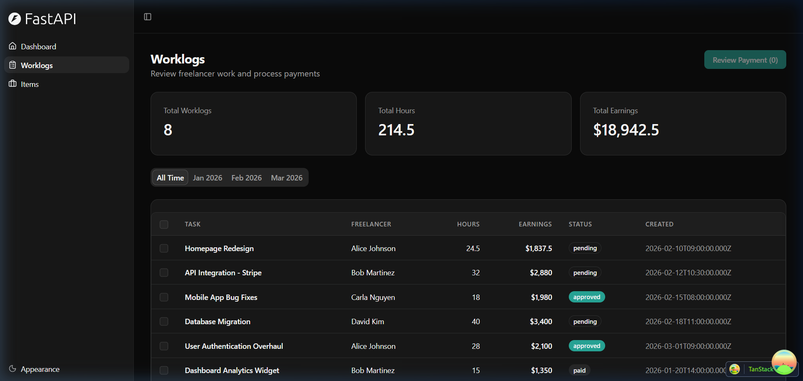
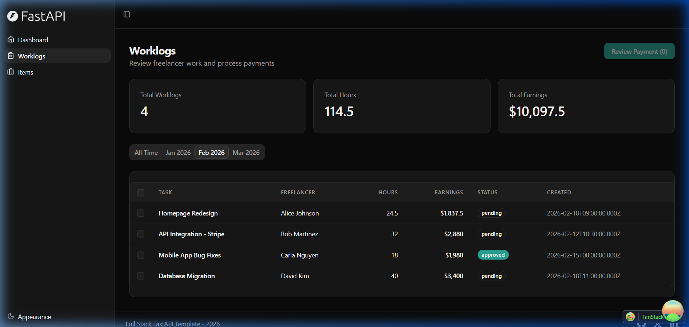
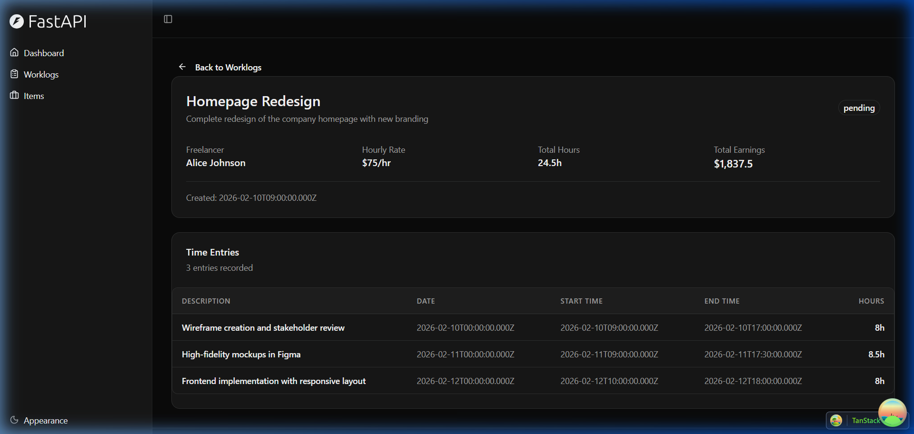
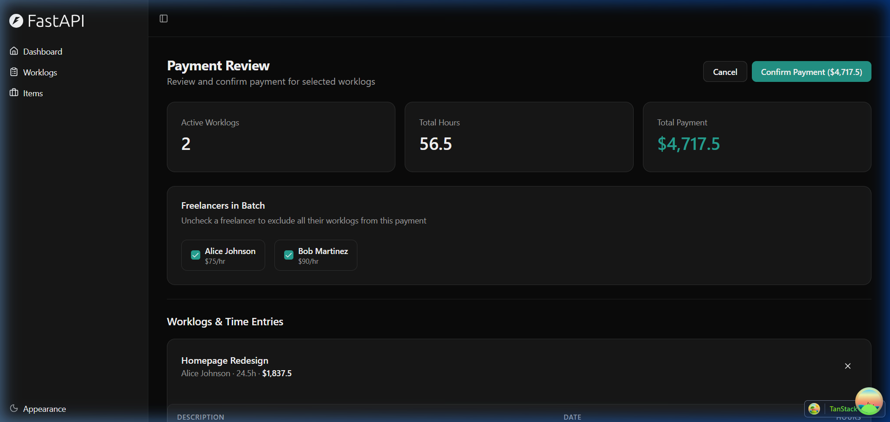

# WorkLog Payment Dashboard — Walkthrough

## Summary

Built a frontend-only admin dashboard for reviewing freelancer worklogs and processing payments. Uses mock JSON data, follows all [AGENTS.md](file:///C:/Users/Administrator/Desktop/developers-assessment/AGENTS.md) conventions.

## Files Changed

| File | Action | Purpose |
|------|--------|---------|
| [mockWorklogs.ts](file:///C:/Users/Administrator/Desktop/developers-assessment/frontend/src/data/mockWorklogs.ts) | NEW | Mock data layer: 4 freelancers, 8 worklogs, 25 time entries |
| [worklogs.tsx](file:///C:/Users/Administrator/Desktop/developers-assessment/frontend/src/routes/_layout/worklogs.tsx) | NEW | Worklogs list with table, date filters, pagination, selection |
| [worklogs_.$worklogId.tsx](file:///C:/Users/Administrator/Desktop/developers-assessment/frontend/src/routes/_layout/worklogs_.$worklogId.tsx) | NEW | Worklog detail with time entries table |
| [payment-review.tsx](file:///C:/Users/Administrator/Desktop/developers-assessment/frontend/src/routes/_layout/payment-review.tsx) | NEW | Payment review with worklog/freelancer exclusion |
| [AppSidebar.tsx](file:///C:/Users/Administrator/Desktop/developers-assessment/frontend/src/components/Sidebar/AppSidebar.tsx) | MODIFIED | Added "Worklogs" nav item |

## Screenshots

### 1. Worklogs List View
Shows all worklogs with summary cards, date filter tabs, and selection checkboxes.

### 2. Date Range Filtering
Feb 2026 filter applied — list narrows to 4 worklogs, totals update dynamically.

### 3. Worklog Details / Time Entries
Drill-down into "Homepage Redesign" showing freelancer info and 3 time entries.

### 4. Payment Review Screen
2 worklogs selected for review. Freelancer exclusion toggles and confirm payment button visible.

## Verification

- **Build**: `npm run build` (tsc + vite) — exit code 0, no TypeScript errors
- **Browser testing**: All 4 screens verified via browser, flows working end-to-end
- **Key flows tested**: List → Filter → Detail drill-down → Back → Select → Review Payment → Exclude freelancer → Confirm
